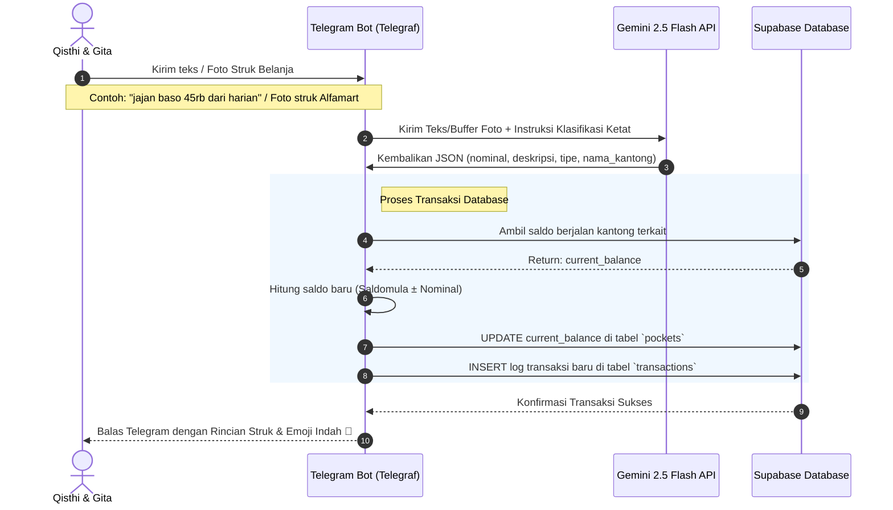
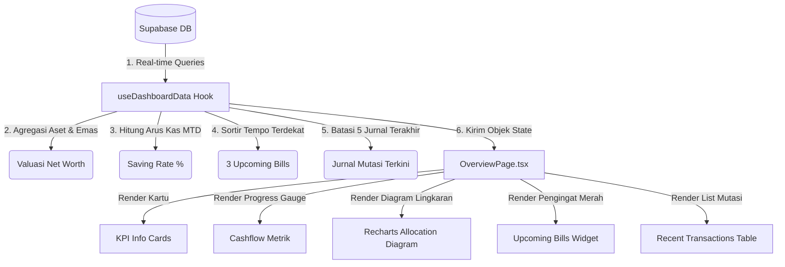

# 💎 Monify: Intelligent Family Financial Hub 🚀

Monify adalah **Arsitektur Kendali Finansial Keluarga** pintar terpusat berbasis kecerdasan buatan (**Gemini 2.5 Flash**) dan database real-time (**Supabase**). Aplikasi ini dirancang khusus untuk sepasang suami istri (Qisthi & Gita) guna mengelola kekayaan bersih, kantong anggaran bulanan, pencatatan otomatis via Telegram, pengingat tagihan bulanan tetap, serta visualisasi metrik likuiditas yang modern dan premium.

---

## ⚡ Fitur Utama & Keunggulan

1. **🤖 AI Telegram Bot Pencatat Otomatis (Gemini 2.5 Flash)**:
   - **Analisis Teks Alami**: Cukup kirim pesan teks biasa seperti *"beli popok bayi 95rb dari bulanan"*, AI akan secara otomatis memecah data nominal, menentukan jenis pengeluaran, mendeteksi kantong dana terkait, memotong saldo kantong, dan menulis jurnal transaksi secara instan di database.
   - **Multimodal OCR (Scanning Struk)**: Cukup foto struk belanja minimarket atau bengkel, AI Gemini akan membaca total akhir nominal belanja, memetakan kategori pos pengeluaran secara ketat, melakukan auto-potong saldo, dan mengirim laporan konfirmasi ramah ke Telegram.

2. **📊 Dasbor Analytics High-End & Real-Time**:
   - Ringkasan **Kekayaan Bersih (Net Worth)** terakumulasi otomatis dari tabungan, dompet digital, valuasi logam mulia real-time, dan kas tunai.
   - Pengukuran **Saving Rate** (Kemampuan Menabung) keluarga secara MTD (Month-to-Date) dilengkapi dengan indikator visual dinamis.
   - Panel **Tagihan Mendatang (Upcoming Bills)** pintar yang mengurutkan prioritas iuran berdasarkan tanggal tempo terdekat.

3. **🛍️ Pembagian Kantong Dana (Pocket Budgeting)**:
   - Membuat pos-pos anggaran bulanan (contoh: *Keperluan Bayi*, *Operasional Harian*, *Kebutuhan Bulanan*, dll) untuk mencegah kebocoran dana dan mengontrol batas belanja bulanan.

4. **💼 Pelacak Aset & Kekayaan Terpadu**:
   - Pemantauan rekening bank, investasi, logam mulia (terintegrasi kalkulator harga emas otomatis per gram), dan saldo dompet digital secara terpusat.

5. **📅 Manajemen Tagihan & Pengingat Bulanan**:
   - Jadwal pengingat otomatis untuk tagihan rutin (Wifi, listrik, paylater, iuran).
   - **Fitur Bayar Sekali-Klik**: Saldo kantong langsung terpotong, tercatat otomatis ke jurnal pengeluaran umum, dan status tagihan ter-update menjadi 'Paid' dalam satu aksi aman.

---

## 🏗️ Arsitektur & Alur Aliran Data (Data Flow)

Sistem Monify bekerja dengan menghubungkan dua antarmuka utama (*React Web Dashboard* dan *Telegram AI Bot*) ke pusat penyimpanan data Supabase yang terintegrasi penuh.

### 1. Aliran Pencatatan Keuangan via Telegram AI Bot


### 2. Aliran Sinkronisasi Analisis Dasbor Web Frontend


---

## 📂 Struktur Folder Proyek (Folder Structure)

Struktur direktori diorganisasikan secara rapi memisahkan *backend* (API & Bot) dengan *frontend* (React SPA) menggunakan kaidah arsitektur bersih (*Clean Architecture*).

```text
assistant_keuangan/
├── backend/                  # SERVER SIDE (Node.js + Telegram Bot + Gemini AI)
│   ├── src/
│   │   ├── config/
│   │   │   └── supabaseClient.ts   # Inisialisasi klien koneksi database Supabase
│   │   ├── services/
│   │   │   └── aiService.ts        # Integrasi Gemini SDK (Parsing teks & Struk Belanja)
│   │   └── index.ts                # Server Express & Handler Long Polling Telegram Bot
│   ├── .env.example                # Templat konfigurasi environment server
│   ├── package.json                # Dependensi backend (Express, Telegraf, Gemini SDK)
│   └── tsconfig.json               # Konfigurasi transpiler TypeScript Backend
│
├── frontend/                 # CLIENT SIDE (React SPA + Vite + Tailwind CSS)
│   ├── src/
│   │   ├── config/
│   │   │   └── supabase.ts         # Konfigurasi Supabase Client Frontend
│   │   ├── context/                # Context global untuk manajemen state tema gelap/terang
│   │   ├── layouts/
│   │   │   └── DashboardLayout.tsx # Layout utama responsif + Collapsible Sidebar Premium
│   │   ├── lib/
│   │   │   ├── formatter.ts        # Helper pemformatan Rupiah (IDR)
│   │   │   └── dateFormatter.ts    # Helper konversi waktu ke format tanggal Indonesia
│   │   ├── routes/
│   │   │   └── AppRoutes.tsx       # Sistem routing aplikasi web (React Router DOM)
│   │   ├── features/               # Arsitektur Berbasis Fitur (Domain Driven)
│   │   │   ├── dashboard/          # Modul Dasbor Utama
│   │   │   │   ├── hooks/          # Custom hooks untuk agregasi dashboard data
│   │   │   │   └── pages/          # Tampilan OverviewPage (KPI, Charts, Bills list)
│   │   │   ├── assets/             # Modul Pelacak Aset Kekayaan
│   │   │   ├── pockets/            # Modul Alokasi Kantong Anggaran
│   │   │   ├── transactions/       # Modul Jurnal Riwayat Mutasi Lengkap
│   │   │   └── bills/              # Modul Pengingat & Pembayaran Tagihan
│   │   ├── index.css               # Reset global CSS & Tailwind Directives
│   │   └── main.tsx                # Titik masuk React (React DOM Client)
│   ├── package.json                # Dependensi frontend (Recharts, Lucide, Tailwind)
│   └── tsconfig.json               # Konfigurasi kompilasi TypeScript Frontend
└── README.md                 # Dokumentasi utama proyek
```

---

## 🗄️ Rancangan Skema Database (Database Schema)

Supabase mengelola empat tabel relasional utama dengan skema terstruktur sebagai berikut:

### 1. Tabel `assets` (Aset Harta & Kekayaan)
```sql
CREATE TABLE assets (
  id bigint GENERATED BY DEFAULT AS IDENTITY PRIMARY KEY,
  name text NOT NULL,                    -- Contoh: 'Bank BCA', 'Logam Mulia Antam'
  category text NOT NULL,                -- 'Tabungan', 'Emas', 'Digital Wallet', 'Cash'
  balance bigint DEFAULT 0,              -- Nominal uang jika kategori tunai/bank
  gold_weight_gram numeric DEFAULT 0,    -- Berat emas jika kategori 'Emas'
  created_at timestamp with time zone DEFAULT timezone('utc'::text, now()) NOT NULL
);
```

### 2. Tabel `pockets` (Kantong Alokasi Anggaran)
```sql
CREATE TABLE pockets (
  id bigint GENERATED BY DEFAULT AS IDENTITY PRIMARY KEY,
  name text NOT NULL,                    -- Nama sistem (contoh: 'keperluan_bayi')
  display_name text NOT NULL,            -- Nama tampilan (contoh: 'Keperluan Bayi')
  target_budget bigint DEFAULT 0,        -- Anggaran yang direncanakan tiap bulan
  current_balance bigint DEFAULT 0,      -- Saldo berjalan real-time saat ini
  created_at timestamp with time zone DEFAULT timezone('utc'::text, now()) NOT NULL
);
```

### 3. Tabel `transactions` (Jurnal Riwayat Mutasi)
```sql
CREATE TABLE transactions (
  id bigint GENERATED BY DEFAULT AS IDENTITY PRIMARY KEY,
  pocket_id bigint REFERENCES pockets(id) ON DELETE SET NULL, -- Pos kantong alokasi
  type text NOT NULL,                    -- 'income' (pemasukan) atau 'expense' (pengeluaran)
  amount bigint DEFAULT 0,               -- Nominal mutasi
  description text NOT NULL,             -- Deskripsi keperluan belanja / sumber gaji
  created_at timestamp with time zone DEFAULT timezone('utc'::text, now()) NOT NULL
);
```

### 4. Tabel `bills` (Daftar Pengingat Tagihan Bulanan)
```sql
CREATE TABLE bills (
  id bigint GENERATED BY DEFAULT AS IDENTITY PRIMARY KEY,
  name text NOT NULL,                    -- Nama tagihan (contoh: 'Biznet Home Wifi')
  amount bigint DEFAULT 0,               -- Nominal tagihan
  due_date integer NOT NULL,             -- Angka jatuh tempo bulanan (1 s/d 31)
  is_recurring boolean DEFAULT true,     -- Apakah berulang tiap bulan
  status text DEFAULT 'unpaid'::text,    -- Status: 'paid' (lunas) atau 'unpaid' (belum bayar)
  last_paid_at timestamp with time zone, -- Waktu eksekusi pembayaran terakhir
  pocket_id bigint REFERENCES pockets(id) ON DELETE SET NULL -- Potong otomatis dari kantong mana
);
```

---

## 🛠️ Langkah Menjalankan Aplikasi Secara Lokal (Setup Guide)

### 1. Persiapan Environment Variables (`.env`)

#### Konfigurasi Backend (`/backend/.env`)
Salin templat konfigurasi di folder backend dan lengkapi datanya:
```env
PORT=5000
SUPABASE_URL=https://xxxxxxxxxxxxxxxxxxxx.supabase.co
SUPABASE_SERVICE_ROLE_KEY=eyJhbGciOiJIUzI1NiIsInR5cCI6IkpXVCJ9...
TELEGRAM_BOT_TOKEN=1234567890:AAH_xxxxxxxxxxxxxxxxxxxxxxxxxx
GEMINI_API_KEY=AIzaSyxxxxxxxxxxxxxxxxxxxxxxxxxx
```
> [!IMPORTANT]
> Backend memerlukan **`SUPABASE_SERVICE_ROLE_KEY`** (bukan anon key) agar bot Telegram dapat melakukan *bypass* RLS untuk mengoreksi dan meng-update saldo kantong secara aman dari eksekusi serverless.

#### Konfigurasi Frontend (`/frontend/.env.local` atau `.env`)
```env
VITE_SUPABASE_URL=https://xxxxxxxxxxxxxxxxxxxx.supabase.co
VITE_SUPABASE_ANON_KEY=eyJhbGciOiJIUzI1NiIsInR5cCI6IkpXVCJ9...
```

---

### 2. Menjalankan Backend & Bot Telegram
1. Buka terminal Anda, arahkan ke folder `/backend`.
2. Jalankan perintah instalasi dependensi:
   ```bash
   npm install
   ```
3. Mulai jalankan server backend dalam mode pengembangan (*development*):
   ```bash
   npm run dev
   ```
4. Server Express akan berjalan di port `5000` dan terminal akan memunculkan pesan:
   `✅ Bot Telegram aktif dan siap menerima pesan!`

---

### 3. Menjalankan Frontend Web Dasbor
1. Buka terminal baru, arahkan ke folder `/frontend`.
2. Install seluruh paket dependensi:
   ```bash
   npm install
   ```
3. Jalankan server lokal pengembangan Vite:
   ```bash
   npm run dev
   ```
4. Buka peramban (*browser*) Anda ke alamat yang tertera di terminal (biasanya `http://localhost:5173`).

---

## 💎 Desain Estetika & Kualitas UI/UX Web

Sistem antarmuka web Monify dirancang dengan standar keindahan visual yang tinggi (*premium design system*):
- **Glassmorphism**: Top navbar dan elemen detail menggunakan perpaduan filter `backdrop-blur-md` dan lapisan transparan semi-putih/semi-hitam yang menyatu secara organik dengan latar belakang halaman.
- **Harmoni Tema (Dark/Light mode)**: Transisi mode gelap yang lembut menggunakan warna dasar malam pekat (`slate-950`) dipadu dengan teks kontras tinggi (`slate-50`) guna mengurangi kelelahan mata saat pemantauan malam hari.
- **Mikro-Animasi Hover**: Elemen tombol, kartu metrik, dan baris mutasi merespon kursor dengan animasi angkat (`-translate-y-1`), pelebaran skala (`scale-105`), serta perputaran dinamis (`animate-hover-spin` pada tombol segarkan data) yang menciptakan kesan antarmuka terasa hidup (*interactive experience*).
