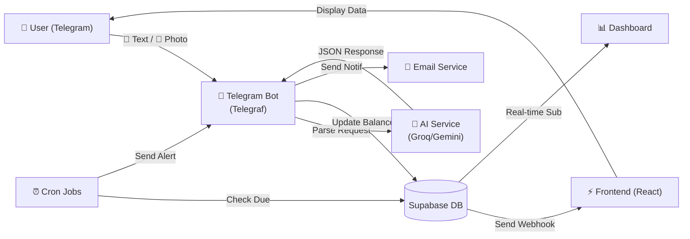
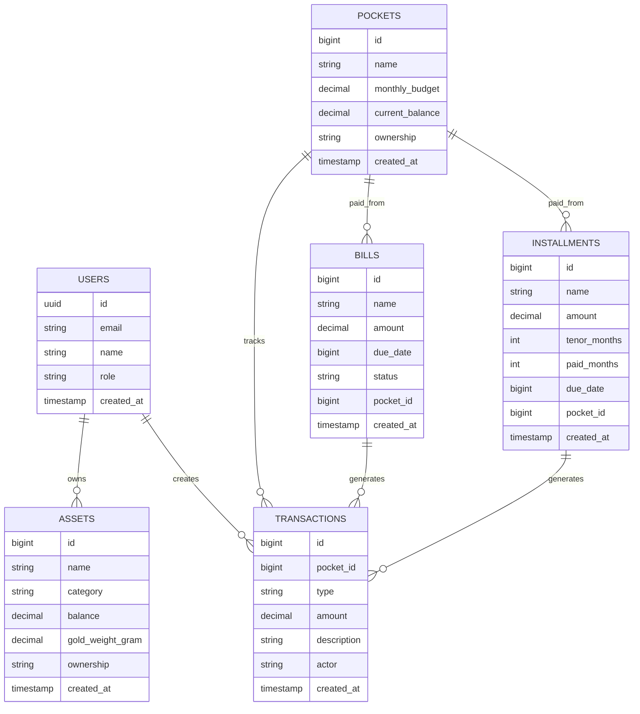

# 💎 Monify: Intelligent Family Financial Hub 🚀

Monify adalah **Intelligent Financial Management System** yang menggabungkan kecerdasan buatan (AI), automation, dan real-time analytics untuk mengelola keuangan keluarga secara terpadu dan efisien. Dirancang khusus untuk sepasang suami istri (Qisthi & Gita), sistem ini menghadirkan pengalaman pencatatan keuangan otomatis via Telegram AI Bot, dashboard analytics premium, manajemen aset terintegrasi, dan sistem notifikasi tagihan yang cerdas.

**Tagline**: _"Keuangan Keluarga yang Transparan, Terukur, dan Terotomasi"_ 💰

---

## 🎯 Visi & Misi

**Visi**: Menjadi pusat pengelolaan keuangan keluarga yang memberikan visibility penuh terhadap aliran dana, aset, dan target finansial dengan mengintegrasikan teknologi AI dan automation.

**Misi**:

- Mengotomasi pencatatan transaksi keuangan agar tidak memberatkan keluarga
- Memberikan insights mendalam tentang pola pengeluaran dan kesehatan finansial keluarga
- Memfasilitasi perencanaan finansial jangka panjang dengan data akurat dan real-time
- Meningkatkan kesadaran keuangan dan transparansi dalam keluarga

---

## ⚡ Fitur Utama & Keunggulan

### 1. 🤖 AI Telegram Bot - Pencatat Otomatis Transaksi (Gemini 2.5 Flash + Groq LLM)

**Fitur**: Pencatatan transaksi otomatis via Telegram dengan Natural Language Processing.

**Kemampuan**:

- **Analisis Teks Natural**: Kirim pesan seperti _"beli popok bayi 95rb dari bulanan"_ → AI otomatis ekstrak nominal (95.000), jenis transaksi (expense), kategori (keperluan_bayi), update saldo kantong, dan catat di database.
- **OCR & Image Recognition (Multimodal)**: Foto struk belanja (Alfamart, Indomaret, dll) → AI membaca nominal total, deteksi kategori pengeluaran, auto-potong saldo kantong, kirim konfirmasi ke Telegram.
- **Smart Pocket Allocation**: Deteksi otomatis kantong dana target berdasarkan konteks (bensin → transportasi, popok → bayi, kopi → harian, dll).
- **Dual-AI System**: Menggunakan **Groq LLM** (gratis, rate limit generous) sebagai primary parser, dengan fallback otomatis ke **Gemini 2.5 Flash** jika rate limit tercapai.
- **Aktor Identification**: Otomatis mengenali siapa yang mengirim (Qisthi/Gita) berdasarkan nama atau context dalam pesan.

**Command Telegram Bot**:

- `/start` - Tampilkan menu & info bot
- `/saldo` atau `"saldo"` - Lihat saldo semua kantong
- `/ringkasan` atau `"rekap"` - Ringkasan cashflow bulanan
- `/laporan` atau `"export"` - Export transaksi sebagai CSV
- `/bayar [nama_tagihan]` - Bayar tagihan dengan sekali-klik
- `/cicil [nama_cicilan]` - Bayar cicilan terminnya
- **Foto Struk** - Kirim foto struk langsung, AI parse otomatis

---

### 2. 📊 Dashboard Analytics Real-Time & Premium

**Lokasi**: `/` (Overview Page)

**Widget & Metrik**:

- **Kekayaan Bersih (Net Worth)**: Agregasi otomatis dari 3 kategori:
  - 🏦 _Shared Assets_ (aset bersama) + 🧑 _Suami Assets_ + 👩 _Istri Assets_
  - Kalkulasi valuasi emas real-time: gram × Rp1.450.000/gram (buyback price)
  - Total: tabungan + investasi + emas + kas tunai

- **Saving Rate (MTD)**: Persentase kemampuan menabung bulan ini
  - Formula: `(Total Income - Total Expense) / Total Income × 100%`
  - Visual progress gauge dengan indikator warna (hijau = baik, merah = perlu ditingkatkan)

- **Upcoming Bills (7 Hari ke Depan)**: Daftar 3 tagihan terdekat yang belum dibayar, diurutkan berdasarkan due_date tercepat
  - Tampil dengan warning icon merah jika sudah overdue

- **Pocket Balance Breakdown**: Pie chart distribusi saldo kantong dana:
  - Kantong bersama (💳) vs kantong personal (🧑/👩)
  - Show/hide detail dengan legend interaktif

- **Recent Transactions**: Tabel 5 transaksi terakhir dengan kolom:
  - Deskripsi, Nominal (color-coded: merah=expense, hijau=income), Kantong, Aktor, Timestamp

**Real-Time Sync**: Semua data ter-update otomatis via Supabase Realtime subscriptions.

---

### 3. 🛍️ Pocket Budgeting - Pembagian & Kontrol Dana

**Lokasi**: `/pockets`

**Fitur**:

- **Daftar Kantong Dana**: Tampilkan semua pocket dengan breakdown:
  - Nama kantong, Icon, Ownership (bersama/suami/istri)
  - Saldo berjalan vs Budget limit
  - Progress bar persentase: `(current_balance / monthly_budget) × 100%`

- **Add Pocket**: Form untuk membuat kantong baru dengan input:
  - Nama kantong, Monthly budget limit, Ownership, Color/icon

- **Edit Pocket**: Update budget limit, ganti ownership, atau archive kantong

- **Kantong Pre-defined** (contoh):
  - 💳 Operasional Utama (bersama, no limit)
  - 🛒 Operasional Harian (bersama, budget 2jt/bulan)
  - 🧑 Jajan Qisthi (suami, budget 500k/bulan)
  - 👩 Jajan Gita (istri, budget 500k/bulan)
  - 🏍️ Transportasi & Kendaraan (bersama, budget 3jt/bulan)
  - 👶 Keperluan Bayi (bersama, budget 2jt/bulan)
  - 📋 Kebutuhan Rutin Bulanan (bersama, budget 5jt/bulan)
  - 💰 Tabungan Masa Depan (bersama, unlimited)

---

### 4. 💼 Assets Tracker - Pelacak Aset & Kekayaan Terpadu

**Lokasi**: `/assets`

**Fitur**:

- **Daftar Aset**: Tampilkan semua aset dengan kategori:
  - Rekening Bank (balance saat ini)
  - Investasi (saham, mutual fund, crypto, dll)
  - Emas/Logam Mulia (gram × harga/gram)
  - Dompet Digital (e-money, BNPL, fintech)
  - Properti (tanah, rumah, dll)

- **Per-Aset Info**:
  - Nama aset, Kategori, Ownership (bersama/suami/istri)
  - Nominal balance atau gram (untuk emas)
  - Valuasi dalam Rupiah (auto-convert dari harga market)
  - Last updated timestamp

- **Add Asset**: Form input dengan pilihan kategori & ownership

- **Edit/Delete Asset**: Update nominal, ownership, atau hapus aset

- **Gold Price Integration**: Kalkulasi otomatis harga emas per gram (default: Rp1.450.000/gram, bisa dikustomisasi)

- **Summary Cards**:
  - Total Aset Bersama, Total Aset Suami, Total Aset Istri
  - Grand Total Net Worth (aset + pockets balance)

---

### 5. 💰 Transactions Journal - Catatan Lengkap Aliran Keuangan

**Lokasi**: `/transactions`

**Fitur**:

- **Tabel Transaksi Lengkap**:
  - Filter by pocket, aktor, type (income/expense), date range
  - Sorting by date, nominal, deskripsi
  - Pagination (20 item per halaman)

- **Kolom Tabel**:
  - #ID, Tanggal & Jam, Deskripsi, Tipe (Income 🟢 / Expense 🔴), Nominal, Kantong, Aktor (Qisthi/Gita)

- **Add Transaction Manual**: Form untuk menambah transaksi secara manual
  - Jika Telegram bot tidak available atau case khusus

- **Delete Transaction**: Opsi hapus dengan konfirmasi (akan reverse saldo kantong)

- **Monthly Summary**:
  - Totalkan income & expense per bulan
  - Hitung net cashflow (income - expense)
  - Trend chart: income vs expense per 6 bulan terakhir

- **Search & Filter**:
  - By description keyword
  - By pocket
  - By actor
  - By date range
  - By type (income/expense/transfer)

---

### 6. 📅 Bills Management - Sistem Tagihan Cerdas

**Lokasi**: `/bills`

**Fitur**:

- **Daftar Tagihan**:
  - Tampilkan nama tagihan, nominal, due date, status (unpaid/paid/overdue)
  - Filter by status, sort by due date
  - Warning visual untuk overdue (background merah)

- **Add Bill**: Form membuat tagihan baru
  - Nama (contoh: "Iuran Wifi", "Cicilan Motor", "Listrik"), Nominal, Due Date, Tipe Recurring (monthly/custom), Linked Pocket

- **Pay Bill (One-Click)**:
  - Tombol "Bayar" → konfirmasi → auto-debit dari linked pocket
  - Transaksi tercatat di journal dengan type: "bill_payment"
  - Status berubah jadi "paid"
  - Email notifikasi dikirim ke partner

- **Mark as Paid**: Untuk tagihan yang sudah dibayar via channel lain

- **Installment Support**:
  - Opsi membuat cicilan multi-tenor (contoh: cicilan motor 12 bulan)
  - Track paid_months vs tenor_months
  - Auto-reminder saat cicilan jatuh tempo

- **Recurring Reminders**:
  - Cron job setiap hari cek tagihan unpaid dengan due date dalam 7 hari ke depan
  - Kirim notif Telegram ke Qisthi & Gita

- **Email Notification**: Pasangan menerima email saat tagihan mendekati jatuh tempo

---

### 7. 🔐 Authentication & Multi-User

**Stack**: Supabase Auth + React Context + Protected Routes

**Fitur**:

- **Login Page**: Email + Password berbasis Supabase
- **Protected Routes**: Redirect ke login jika belum authenticated
- **Auth Context**: Global state untuk current user (Qisthi/Gita)
- **Logout**: Clear session & redirect ke login

---

### 8. 📧 Notification System

**Channels**:

- **Telegram Bot**: Konfirmasi transaksi, reminder tagihan, ringkasan harian/mingguan
- **Email (Nodemailer)**: Notifikasi transaksi besar, reminder tagihan overdue, laporan bulanan
- **Scheduled Cron**: Email ringkasan bulanan, cek tagihan jatuh tempo

---

## 🏗️ Arsitektur Sistem

### Backend Architecture

```
Backend (Node.js + Express)
├── Telegram Bot (Telegraf)
│   ├── Message Handler (text input)
│   ├── Photo Handler (struk scanning)
│   ├── Command Handler (/saldo, /bayar, dll)
│   └── Long Polling / Webhook
│
├── AI Services
│   ├── Groq LLM (Primary Parser)
│   ├── Gemini 2.5 Flash (Fallback + Multimodal OCR)
│   └── JSON Response Formatter
│
├── Database Layer (Supabase)
│   ├── transactions (mutasi)
│   ├── pockets (kantong dana)
│   ├── bills (tagihan)
│   ├── installments (cicilan)
│   ├── assets (aset)
│   └── users (user account)
│
├── Cron Jobs (Scheduled Tasks)
│   ├── Daily Bill Reminder (07:00, 14:00)
│   ├── Weekly Summary Email
│   └── Monthly Report Generation
│
└── Notification Services
    ├── Telegram Service (sendMessage, sendPhoto)
    ├── Email Service (Nodemailer + Gmail)
    └── Push Notification (optional future)
```

### Frontend Architecture

```
Frontend (React + Vite)
├── Pages (Route-based)
│   ├── LoginPage (authentication)
│   ├── OverviewPage (dashboard)
│   ├── AssetsPage (aset)
│   ├── PocketsPage (kantong)
│   ├── TransactionsPage (journal)
│   └── BillsPage (tagihan)
│
├── Features (Feature-based structure)
│   ├── Dashboard
│   │   ├── hooks (useDashboardData)
│   │   ├── components
│   │   └── pages (OverviewPage)
│   ├── Assets
│   ├── Pockets
│   ├── Transactions
│   └── Bills
│
├── Hooks (Custom Logic)
│   ├── useAssets
│   ├── usePockets
│   ├── useTransactions
│   ├── useBills
│   └── useDashboardData
│
├── Components
│   ├── Layout (DashboardLayout)
│   ├── UI (shadcn-style)
│   ├── Protected Routes
│   └── Reusable Components
│
├── Config
│   ├── supabase.ts (client setup)
│   └── auth.ts (auth config)
│
└── Context
    └── AuthContext (global auth state)
```

### Data Flow Diagram



---

## 📂 Struktur Folder Proyek (Folder Structure)

```text
assistant_keuangan/
│
├── backend/                           # SERVER (Node.js + Telegram Bot + AI)
│   ├── src/
│   │   ├── config/
│   │   │   └── supabaseClient.ts      # Supabase client initialization
│   │   │
│   │   ├── services/
│   │   │   ├── aiService.ts           # Groq + Gemini AI parser
│   │   │   │                          # - parseFinancialText(text) → ParsedTransaction
│   │   │   │                          # - parseFinancialImage(base64) → ParsedTransaction
│   │   │   │                          # - getAIStatus() → current AI availability
│   │   │   │
│   │   │   ├── cronService.ts         # Scheduled background jobs
│   │   │   │                          # - checkDueBills() [daily 7am/2pm]
│   │   │   │                          # - checkDueInstallments() [daily]
│   │   │   │                          # - setBotInstance(bot) [init]
│   │   │   │
│   │   │   └── notificationService.ts # Email & Telegram notifications
│   │   │                              # - sendTransactionEmailNotification()
│   │   │                              # - sendBillReminderEmail()
│   │   │
│   │   └── index.ts                   # Express server + Telegram bot handler
│   │                                  # - Bot middleware (auth check)
│   │                                  # - Command handlers (/start, /saldo, etc)
│   │                                  # - Message handler (text parsing)
│   │                                  # - Photo handler (OCR)
│   │                                  # - Callback query (inline buttons)
│   │                                  # - Error handling
│   │
│   ├── .env.example                   # Environment template
│   ├── package.json                   # Dependencies: Telegraf, @google/generative-ai,
│   │                                  #              Supabase, Nodemailer, Groq, etc.
│   ├── tsconfig.json                  # TypeScript config
│   └── dist/                          # Compiled JavaScript (build output)
│
├── frontend/                          # CLIENT (React SPA + Vite)
│   ├── src/
│   │   ├── config/
│   │   │   └── supabase.ts            # Supabase client + RLS config
│   │   │
│   │   ├── context/
│   │   │   └── AuthContext.tsx        # Global auth state (current user)
│   │   │
│   │   ├── components/
│   │   │   ├── ProtectedRoute.tsx     # Route guard wrapper
│   │   │   └── ui/                    # Reusable UI components
│   │   │
│   │   ├── features/                  # Feature-based folder structure
│   │   │   ├── dashboard/
│   │   │   │   ├── hooks/
│   │   │   │   │   └── useDashboardData.ts  # Dashboard data fetching & aggregation
│   │   │   │   ├── components/              # Dashboard widgets
│   │   │   │   └── pages/
│   │   │   │       └── OverviewPage.tsx     # Dashboard overview (main page)
│   │   │   │
│   │   │   ├── assets/
│   │   │   │   ├── hooks/
│   │   │   │   │   └── useAssets.ts        # Assets CRUD operations
│   │   │   │   ├── components/
│   │   │   │   └── pages/
│   │   │   │       └── AssetsPage.tsx
│   │   │   │
│   │   │   ├── pockets/
│   │   │   │   ├── hooks/
│   │   │   │   │   └── usePockets.ts       # Pockets CRUD + balance updates
│   │   │   │   ├── components/
│   │   │   │   └── pages/
│   │   │   │       └── PocketsPage.tsx
│   │   │   │
│   │   │   ├── transactions/
│   │   │   │   ├── hooks/
│   │   │   │   │   └── useTransactions.ts  # Transactions fetch/add/delete
│   │   │   │   ├── components/
│   │   │   │   └── pages/
│   │   │   │       └── TransactionsPage.tsx
│   │   │   │
│   │   │   └── bills/
│   │   │       ├── hooks/
│   │   │       │   └── useBills.ts         # Bills CRUD + payment + installments
│   │   │       ├── components/
│   │   │       └── pages/
│   │   │           └── BillsPage.tsx
│   │   │
│   │   ├── hooks/                     # App-level custom hooks (if any)
│   │   ├── layouts/
│   │   │   └── DashboardLayout.tsx    # Main layout (sidebar + header + outlet)
│   │   │
│   │   ├── lib/
│   │   │   ├── dateFormatter.ts       # Date utility functions
│   │   │   └── formatter.ts           # Currency, number formatting
│   │   │
│   │   ├── pages/
│   │   │   └── LoginPage.tsx          # Authentication entry point
│   │   │
│   │   ├── routes/
│   │   │   └── AppRoutes.tsx          # Route definitions (protected + public)
│   │   │
│   │   ├── App.tsx                    # Root component
│   │   ├── main.tsx                   # React DOM render
│   │   ├── App.css                    # Global styles
│   │   └── index.css                  # Tailwind imports
│   │
│   ├── public/                        # Static assets
│   ├── eslint.config.js               # ESLint rules
│   ├── tailwind.config.js             # Tailwind CSS config
│   ├── vite.config.ts                 # Vite bundler config
│   ├── tsconfig.json                  # TypeScript config
│   ├── package.json                   # Dependencies: React, Recharts, React Router,
│   │                                  #              Lucide Icons, Tailwind, etc.
│   └── dist/                          # Production build output
│
├── .gitignore                         # Git ignore patterns
├── README.md                          # This file
└── .git/                              # Git repository
```

---

## 🔧 Tech Stack & Dependensi

### Backend Stack

| Technology                | Versi   | Peran                     |
| ------------------------- | ------- | ------------------------- |
| **Node.js**               | 18+     | JavaScript Runtime        |
| **Express.js**            | 5.2.1   | REST API Framework        |
| **TypeScript**            | 6.0.3   | Type Safety               |
| **Telegraf**              | 4.16.3  | Telegram Bot Framework    |
| **@google/generative-ai** | 0.24.1  | Gemini AI Integration     |
| **OpenAI**                | 6.39.0  | Groq API Client           |
| **@supabase/supabase-js** | 2.106.2 | Database Client           |
| **Nodemailer**            | 8.0.9   | Email Service             |
| **axios**                 | 1.16.1  | HTTP Client               |
| **dotenv**                | 17.4.2  | Environment Variables     |
| **tsx**                   | 4.22.3  | TypeScript Executor (dev) |
| **nodemon**               | 3.1.14  | Auto-restart (dev)        |

### Frontend Stack

| Technology                | Versi    | Peran                 |
| ------------------------- | -------- | --------------------- |
| **React**                 | 19.2.6   | UI Framework          |
| **React DOM**             | 19.2.6   | DOM Rendering         |
| **React Router**          | 7.15.1   | Routing & Navigation  |
| **TypeScript**            | 6.0.2    | Type Safety           |
| **Vite**                  | 8.0.12   | Build Bundler         |
| **Tailwind CSS**          | 4.3.0    | Utility-First CSS     |
| **Recharts**              | 3.8.1    | Chart & Visualization |
| **Lucide React**          | 1.17.0   | Icon Library          |
| **SweetAlert2**           | 11.26.25 | Alert & Modal UI      |
| **@supabase/supabase-js** | 2.106.2  | Database Client       |

### Database & Infrastructure

| Service               | Peran                                                 |
| --------------------- | ----------------------------------------------------- |
| **Supabase**          | PostgreSQL Database + Auth + Realtime + Storage       |
| **Telegram Bot API**  | Bot communication                                     |
| **Gmail SMTP**        | Email sending via Nodemailer                          |
| **Groq Cloud API**    | Primary AI parsing (rate limit generous: 30 req/min)  |
| **Google Gemini API** | Fallback AI + multimodal OCR (rate limit: 15 req/min) |

---

## 🚀 Instalasi & Setup

### Prerequisites

- Node.js 18+ & npm/yarn
- Git
- Akun Supabase
- Telegram Bot Token (dari BotFather)
- Gmail Account (App Password untuk Nodemailer)
- Google Gemini API Key
- Groq API Key (optional, tapi recommended)

### 1. Clone Repository

```bash
git clone https://github.com/yourusername/assistant_keuangan.git
cd assistant_keuangan
```

### 2. Setup Backend

```bash
cd backend
npm install
```

**Buat file `.env` di `backend/` dengan template dari `.env.example`:**

```env
# Supabase
SUPABASE_URL=https://your-project.supabase.co
SUPABASE_KEY=your-anon-key
SUPABASE_SERVICE_KEY=your-service-role-key

# Telegram Bot
TELEGRAM_BOT_TOKEN=your-bot-token-from-botfather
ALLOWED_USERS={"123456789":"suami","987654321":"istri"}

# AI Services
GEMINI_API_KEY=your-gemini-key
GEMINI_MODEL=gemini-2.5-flash
GROQ_API_KEY=your-groq-api-key
GROQ_MODEL=llama-3.1-8b-instant

# Email
EMAIL_USER=your-gmail@gmail.com
EMAIL_APP_PASSWORD=your-gmail-app-password

# Server
PORT=5000
NODE_ENV=development
```

**Run Backend**:

```bash
npm run dev          # Development mode (dengan auto-restart)
npm run build        # Compile TypeScript to JavaScript
npm run start        # Production mode
```

### 3. Setup Frontend

```bash
cd frontend
npm install
```

**Run Frontend**:

```bash
npm run dev          # Development mode (Vite dev server)
npm run build        # Production build
npm run preview      # Preview production build
npm run lint         # Run ESLint
```

### 4. Database Setup (Supabase)

Buat tabel di Supabase dengan schema berikut:

**Tabel: `users`**

```sql
CREATE TABLE users (
  id UUID PRIMARY KEY DEFAULT gen_random_uuid(),
  email VARCHAR(255) UNIQUE NOT NULL,
  name VARCHAR(255),
  role VARCHAR(50), -- 'suami' or 'istri'
  created_at TIMESTAMP DEFAULT NOW()
);
```

**Tabel: `assets`**

```sql
CREATE TABLE assets (
  id BIGSERIAL PRIMARY KEY,
  name VARCHAR(255) NOT NULL,
  category VARCHAR(100), -- 'bank', 'investasi', 'emas', 'dompet_digital', 'properti'
  balance DECIMAL(15,2),
  gold_weight_gram DECIMAL(10,2),
  ownership VARCHAR(50), -- 'bersama', 'suami', 'istri'
  created_at TIMESTAMP DEFAULT NOW(),
  updated_at TIMESTAMP DEFAULT NOW()
);
```

**Tabel: `pockets`**

```sql
CREATE TABLE pockets (
  id BIGSERIAL PRIMARY KEY,
  name VARCHAR(255) NOT NULL,
  display_name VARCHAR(255),
  monthly_budget DECIMAL(15,2),
  current_balance DECIMAL(15,2) DEFAULT 0,
  ownership VARCHAR(50), -- 'bersama', 'suami', 'istri'
  icon VARCHAR(10),
  color VARCHAR(7),
  created_at TIMESTAMP DEFAULT NOW(),
  updated_at TIMESTAMP DEFAULT NOW()
);
```

**Tabel: `transactions`**

```sql
CREATE TABLE transactions (
  id BIGSERIAL PRIMARY KEY,
  pocket_id BIGINT REFERENCES pockets(id),
  type VARCHAR(50), -- 'income', 'expense', 'transfer'
  amount DECIMAL(15,2) NOT NULL,
  description VARCHAR(500),
  actor VARCHAR(50), -- 'suami', 'istri'
  created_at TIMESTAMP DEFAULT NOW()
);
```

**Tabel: `bills`**

```sql
CREATE TABLE bills (
  id BIGSERIAL PRIMARY KEY,
  name VARCHAR(255) NOT NULL,
  amount DECIMAL(15,2) NOT NULL,
  due_date BIGINT, -- Unix timestamp
  status VARCHAR(50) DEFAULT 'unpaid', -- 'unpaid', 'paid', 'overdue'
  pocket_id BIGINT REFERENCES pockets(id),
  recurring BOOLEAN DEFAULT FALSE,
  created_at TIMESTAMP DEFAULT NOW(),
  updated_at TIMESTAMP DEFAULT NOW()
);
```

**Tabel: `installments`**

```sql
CREATE TABLE installments (
  id BIGSERIAL PRIMARY KEY,
  name VARCHAR(255) NOT NULL,
  amount DECIMAL(15,2) NOT NULL,
  tenor_months INT,
  paid_months INT DEFAULT 0,
  due_date BIGINT,
  pocket_id BIGINT REFERENCES pockets(id),
  status VARCHAR(50) DEFAULT 'active', -- 'active', 'completed'
  created_at TIMESTAMP DEFAULT NOW(),
  updated_at TIMESTAMP DEFAULT NOW()
);
```

---

## 📊 Database Schema Relation Diagram



---

## 🎨 UI/UX Features & Design Patterns

### Color Scheme

- **Primary**: Blue (#2563EB)
- **Success**: Green (#10B981)
- **Warning**: Yellow (#F59E0B)
- **Danger**: Red (#EF4444)
- **Neutral**: Gray (#6B7280)

### Responsive Design

- Mobile-first approach dengan Tailwind CSS
- Breakpoints: sm (640px), md (768px), lg (1024px), xl (1280px)
- Sidebar collapsible di mobile

### Icons & Emojis

- **Pocket Icons**: 💳 bersama, 🧑 suami, 👩 istri
- **Pocket Types**: 🛒 operasional, 🧑 jajan, 🏍️ transportasi, 👶 bayi, 💰 tabungan
- **Transaction**: 🟢 income, 🔴 expense, 🔵 transfer
- **Status**: ✅ paid, ⚠️ unpaid, 🚨 overdue

### Toast Notifications

- Success: "✅ Transaksi berhasil dicatat!"
- Error: "❌ Gagal mencatat transaksi. Coba lagi."
- Info: "ℹ️ Saldo kantong telah diupdate."

### Loading & Skeleton States

- Skeleton loaders untuk tabel & chart saat fetch data
- Loading spinners untuk async operations
- Optimistic UI updates untuk perceived performance

---

## 🔐 Security & Authentication

### Frontend Security

- **Protected Routes**: Redirect ke login jika token expired
- **Session Storage**: Token disimpan di local storage (bisa upgrade ke secure cookie)
- **CORS**: Configured di backend Express

### Backend Security

- **Telegram Auth**: Whitelist ALLOWED_CHAT_IDS di `.env`
- **Supabase RLS**: Row-level security policies per user
- **API Rate Limiting**: (Optional) implement express-rate-limit
- **Input Validation**: AI parser validate amount/type sebelum insert DB
- **Error Handling**: Jangan expose internal error ke client

### Environment Variables

- Semua secrets (.env) di gitignore
- Gunakan `.env.example` untuk template
- Backend & Frontend env terpisah

---

## 📱 Bot Commands Reference

| Command         | Syntax                           | Deskripsi                                      |
| --------------- | -------------------------------- | ---------------------------------------------- |
| `/start`        | `/start`                         | Tampilkan menu & info bot                      |
| `/saldo`        | `/saldo` atau `"saldo"`          | Tampilkan saldo semua kantong                  |
| `/ringkasan`    | `/ringkasan` atau `"rekap"`      | Ringkasan cashflow bulanan (income vs expense) |
| `/laporan`      | `/laporan` atau `"export"`       | Export semua transaksi bulan ini sebagai CSV   |
| `/bayar`        | `/bayar [nama_tagihan]`          | Bayar tagihan dengan sekali-klik (auto-debit)  |
| `/cicil`        | `/cicil [nama_cicilan]`          | Bayar cicilan termin berikutnya                |
| **Text Input**  | `"beli popok 95rb dari bulanan"` | Catat transaksi otomatis via NLP               |
| **Photo Input** | Send foto struk                  | Scan OCR & auto-extract nominal + kategori     |

---

## 🧪 Testing & QA

### Manual Testing Checklist

- [ ] Login/logout flow
- [ ] Add transaction via bot + manual
- [ ] Update saldo kantong otomatis
- [ ] Cek dashboard summary akurat
- [ ] Add/edit aset & recount net worth
- [ ] Add/edit/delete tagihan
- [ ] Bayar tagihan one-click
- [ ] Email notification terkirim
- [ ] Cron jobs jalan tepat waktu

### Automated Testing (Future)

- Unit tests dengan Jest (backend + frontend)
- E2E tests dengan Playwright
- Load testing untuk API endpoints

---

## 🚦 Deployment Guide

### Hosting Options

1. **Backend**:
   - Render, Railway, Replit, Heroku (paused), DigitalOcean App Platform
   - Minimal: RAM 512MB, 1 CPU

2. **Frontend**:
   - Vercel (recommended), Netlify, GitHub Pages
   - Static build, CDN global

3. **Database**:
   - Supabase (free tier 500MB, included)
   - PostgreSQL managed

### Deployment Steps

1. Build backend: `npm run build`
2. Build frontend: `npm run build`
3. Push to Git (GitHub, GitLab, etc.)
4. Connect repo ke hosting platform
5. Set environment variables di platform
6. Auto-deploy on push to main branch

---

## 📋 Panduan Kontribusi & Development

### Branching Strategy

```
main (production-ready)
├── develop (integration branch)
│   ├── feature/telegram-bot-upgrade
│   ├── feature/asset-tracking
│   ├── bugfix/saldo-calculation
│   └── ...
```

### Commit Convention

```
feat: Add feature X
fix: Fix bug Y
docs: Update README
refactor: Improve code structure
test: Add test for X
chore: Update dependencies
```

### Code Style

- **Prettier** + **ESLint** (enforced via pre-commit hooks - TODO)
- TypeScript strict mode enabled
- Functional components only (React Hooks)
- Custom hooks untuk logic reusability

---

## 🐛 Troubleshooting

| Masalah                | Solusi                                                                    |
| ---------------------- | ------------------------------------------------------------------------- |
| Bot tidak merespons    | Check TELEGRAM_BOT_TOKEN di .env, check internet connection               |
| Saldo tidak ter-update | Check Supabase connection, verify pocket_id exist                         |
| Email tidak terkirim   | Gunakan Gmail App Password (bukan password akun biasa)                    |
| Gemini rate limit      | System auto-fallback ke Groq, jika keduanya error, coba 30 menit kemudian |
| Frontend blank page    | Check browser console errors, verify Supabase config                      |

---

## 📞 Support & Contact

- **Email**: qisthih@gmail.com
- **Telegram**: @bot_monify
- **GitHub Issues**: [Report bug atau request feature](https://github.com/yourusername/assistant_keuangan/issues)

---

## 📜 License

MIT License - Bebas digunakan, dimodifikasi, dan didistribusikan dengan attribution.

---

---

## 🎯 Planning Rekomendasi Penambahan Fitur (Future Roadmap)

Berdasarkan analisis menyeluruh terhadap konsep **Financial Management**, berikut rekomendasi fitur yang sesuai dan dapat meningkatkan nilai aplikasi Monify. **SEMUA REKOMENDASI INI TIDAK MENGUBAH ATAU MENGHILANGKAN FITUR YANG SUDAH ADA**, hanya menambah kapabilitas baru.

---

### **TIER 1: FITUR PRIORITAS TINGGI** (0-3 Bulan)

#### 1.1 📈 **Budget Planning & Forecasting**

**Deskripsi**: Fitur perencanaan budget berdasarkan data historis dan tren pengeluaran.

**Implementasi**:

- **Auto-Budget Suggestion**: Analisis data transaksi 3 bulan terakhir → hitung rata-rata pengeluaran per pocket → suggestikan budget optimal
- **Spending Forecast**: Prediksi pengeluaran bulan depan berdasarkan pola historis + seasonal patterns
- **Budget vs Actual Chart**: Visualization membandingkan budget terencana vs actual spending per pocket
- **Alert Threshold**: Notif Telegram jika pengeluaran pocket sudah mencapai 80% budget limit

**Flow Implementasi**:

1. Backend: Tambah endpoint GET `/api/budget-analysis` (aggregate & ML simple)
2. Frontend: Tambah component `BudgetForecast` di dashboard
3. Database: Tambah table `budget_plans` untuk menyimpan rencana budget custom user
4. Cron: Daily update forecast calculation

**Benefit untuk User**: Lebih proaktif dalam mengelola uang & menghindari overspending

---

#### 1.2 💹 **Spending Analytics & Insights**

**Deskripsi**: Dashboard analytics mendalam dengan visualisasi tren pengeluaran kategori-per-kategori.

**Implementasi**:

- **Category Breakdown Pie Chart**: Pie chart detail persentase pengeluaran per kategori (bayi 25%, transportasi 20%, dll)
- **Monthly Trend Line Chart**: Line chart 12 bulan terakhir menampilkan income vs expense trend
- **Top Expenses Widget**: Widget "Top 5 Pengeluaran Terbesar Bulan Ini" dengan nomina & pocket
- **Saving Goals Tracking**: Track progress terhadap saving target yang ditetapkan (contoh: "Kumpulin 10jt tabungan tahun ini")
- **Spending Comparison**: Bandingkan pengeluaran bulan ini vs bulan lalu / tahun lalu dengan % change indicator

**Flow Implementasi**:

1. Backend: Extend `useDashboardData` hook dengan analytics queries
2. Frontend: Tambah fitur tab di OverviewPage (Dashboard → Analytics → Insights)
3. Chart Library: Recharts sudah tersedia, tinggal design chartnya

**Benefit untuk User**: Visibility penuh tentang kemana uang mereka pergi, identifikasi area penghematan

---

#### 1.3 🎯 **Saving Goals & Target Management**

**Deskripsi**: Fitur perencanaan target finansial jangka panjang (misalnya: "Nabung 100jt untuk liburan tahun depan").

**Implementasi**:

- **Create Goal**: Form membuat saving goal dengan target nominal, deadline, dan linked pocket
- **Progress Tracking**: Widget menampilkan progress bar tujuan (contoh: "Liburan: Rp50jt dari Rp100jt target, 50%")
- **Goal Status**: Kategori goal (Active, Achieved, Abandoned) dengan timeline visualization
- **Goal Notification**: Monthly reminder progress goal via Telegram
- **Contribution Logging**: Dapat log kontribusi manual ke goal atau auto-link dari pocket tertentu

**Schema Addition**:

```sql
CREATE TABLE saving_goals (
  id BIGSERIAL PRIMARY KEY,
  name VARCHAR(255) NOT NULL,
  target_amount DECIMAL(15,2),
  current_amount DECIMAL(15,2) DEFAULT 0,
  deadline BIGINT,
  linked_pocket_id BIGINT REFERENCES pockets(id),
  status VARCHAR(50) DEFAULT 'active', -- 'active', 'achieved', 'abandoned'
  created_at TIMESTAMP DEFAULT NOW()
);
```

**Benefit untuk User**: Memotivasi untuk menabung & clear financial target, family dapat track progress saving goal bersama

---

#### 1.4 💳 **Multi-Currency & International Transactions**

**Deskripsi**: Support multiple currencies untuk transaksi internasional atau digital assets.

**Implementasi**:

- **Multi-Currency Pockets**: Pocket dapat di-set dalam currency berbeda (IDR, USD, EUR, JPY, dll)
- **Real-time Exchange Rate**: Fetch rate dari API publik (contoh: exchangerate-api.com) dan cache 1 jam
- **Auto-Conversion to Base Currency**: Konversi semua pengeluaran ke currency base (IDR) untuk aggregation
- **Currency Widget**: Display aset dalam multiple currencies dengan exchange rate indicator

**Flow Implementasi**:

1. Backend: Extend `aiService.ts` untuk detect & convert currency
2. Frontend: Add currency selector di transaction form & pocket settings
3. Database: Add `currency` column di pockets table
4. API: Integrate exchangerate-api atau similar untuk real-time rates

**Benefit untuk User**: Jika ada transaksi luar negeri atau investasi crypto, sistem tetap dapat track

---

### **TIER 2: FITUR STANDAR MEDIUM PRIORITY** (3-6 Bulan)

#### 2.1 📊 **Advanced Reporting & Export**

**Deskripsi**: Export & generate report dalam format profesional (PDF, Excel, JSON).

**Implementasi**:

- **PDF Report Generator**: Monthly/yearly report dengan header, summary, detailed transactions, charts
- **Excel Export**: Lengkap dengan formatting & formula (subtotal per kategori, dll)
- **Custom Date Range Report**: Generate report untuk period custom (quarter, semester, tahun, dll)
- **Email Report**: Auto-send monthly report ke email user via Nodemailer
- **Report Scheduling**: User dapat schedule report dikirim every 1st of month otomatis

**Libraries**:

- `pdfkit` atau `html-pdf` untuk PDF generation
- `xlsx` atau `exceljs` untuk Excel export

**Benefit untuk User**: Lebih mudah share financial data dengan auditor/akuntan, atau personal archive

---

#### 2.2 🤝 **Collaborative Features & Comments**

**Deskripsi**: Fitur kolaborasi antar user (suami & istri) untuk komunikasi dalam app.

**Implementasi**:

- **Transaction Comments**: Tiap transaksi bisa di-comment oleh salah satu user (clarification atau approval)
- **Shared Notes**: Whiteboard/notes untuk planning finansial bersama
- **Approval Workflow** (Optional): Untuk transaksi besar, require approval dari partner sebelum finalize
- **Activity Feed**: Timeline aktivitas keuangan (Qisthi membayar tagihan wifi, Gita menambah aset, dll)
- **Notification System**: User mendapat notif saat ada comment atau activity baru

**Benefit untuk User**: Transparansi penuh, aligned financial decision making dalam keluarga

---

#### 2.3 🔐 **Enhanced Security & 2FA**

**Deskripsi**: Fitur keamanan berlapis untuk melindungi financial data.

**Implementasi**:

- **Two-Factor Authentication (2FA)**: Email OTP atau Google Authenticator
- **Session Management**: Logout dari device lain, device whitelist
- **Audit Logs**: Track siapa yang mengubah apa dan kapan
- **Data Encryption**: Encrypt sensitive fields (SSN, account numbers) di database
- **Rate Limiting**: Protect API dari brute force & DDoS attacks

**Libraries**:

- `speakeasy` untuk TOTP/2FA
- `bcrypt` untuk password hashing

**Benefit untuk User**: Peace of mind, compliance dengan keamanan financial data

---

#### 2.4 📱 **Mobile App (Native/React Native)**

**Deskripsi**: Native mobile app untuk iOS/Android untuk on-the-go financial management.

**Implementasi**:

- **React Native or Flutter**: Share API dengan backend yang sama
- **Core Features**: Dashboard, quick transaction add, bills, notifications
- **Push Notifications**: Real-time push untuk transaction alerts & reminders
- **Offline Mode**: Cache data locally, sync saat online kembali
- **Biometric Auth**: Touch ID / Face ID untuk quick login

**Benefit untuk User**: Akses dari mana saja, faster transaction logging, better user experience

---

### **TIER 3: FITUR PREMIUM & NICE-TO-HAVE** (6-12 Bulan)

#### 3.1 🤖 **Advanced AI Features**

**Deskripsi**: Fitur AI lebih advanced untuk smart recommendations & automation.

**Implementasi**:

- **Spending Pattern Recognition**: AI detect anomali pengeluaran (sudden spike)
- **Automated Categorization Learning**: ML model belajar dari user corrections untuk improve accuracy
- **Financial Health Score**: Calculate score (0-100) berdasarkan saving rate, debt ratio, emergency fund
- **Smart Recommendations**: "Berdasarkan pola Anda, bisa hemat 15% di kategori bayi dengan pindah brand X"
- **Voice Command**: Add voice input ke Telegram bot atau mobile app

**Libraries**:

- `tensorflow.js` atau TensorFlow Python untuk ML model
- `natural` untuk NLP enhancement

**Benefit untuk User**: Personalized financial guidance, smarter automation

---

#### 3.2 💰 **Investment Tracking & Portfolio**

**Deskripsi**: Track investasi (saham, mutual fund, crypto) dengan real-time valuation.

**Implementasi**:

- **Portfolio Dashboard**: Daftar semua investasi dengan current value & gain/loss
- **Stock/Fund Integration**: API integration dengan bursa (BNI Securities, Binomo, dll) untuk auto-fetch prices
- **Crypto Wallet Integration**: Connect ke popular wallets (MetaMask, Binance, dll) untuk auto-track
- **Return on Investment (ROI) Calculation**: Display return % & absolute gain/loss
- **Dividend Tracker**: Log dividend income & reinvestment

**Flow Implementasi**:

1. Extend `assets` table dengan `portfolio` sub-table
2. Backend cron: Fetch real-time prices daily
3. Frontend: New feature page `/investments`

**Benefit untuk User**: Holistic wealth management, monitor investment performance

---

#### 3.3 🏦 **Bank Integration & Auto-Sync**

**Deskripsi**: Direct integration dengan bank untuk auto-sync transactions.

**Implementasi**:

- **Open Banking API**: Use API dari bank (BCA, BRI, Mandiri) atau fintech middleware (Xendit, Fintech)
- **Auto-Transaction Sync**: Setiap transaksi bank otomatis di-log ke Monify
- **Balance Sync**: Saldo rekening otomatis update real-time
- **Bill Payment**: Direct payment ke bank dari app (jika tersedia)
- **Reconciliation**: Automatic matching antara bank statement & logged transactions

**Consideration**: Indonesia banking landscape masih developing untuk open banking, perlu comply dengan regulasi BI

**Benefit untuk User**: Zero manual entry, 100% accuracy, real-time sync

---

#### 3.4 💳 **Debt Management & Loan Tracker**

**Deskripsi**: Fitur tracking hutang & planning repayment strategy.

**Implementasi**:

- **Debt List**: Add loan entries (cicilan motor, kartu kredit, pinjam teman)
- **Payment Schedule**: Auto-generate payment schedule dengan amortization calculation
- **Interest Calculator**: Display total interest yang akan dibayarkan
- **Prepayment Strategy**: Recommend optimal order untuk melunasi debt (avalanche vs snowball)
- **Debt Consolidation**: Suggestion untuk consolidate multiple debts into one

**Database**:

```sql
CREATE TABLE debts (
  id BIGSERIAL PRIMARY KEY,
  name VARCHAR(255),
  principal_amount DECIMAL(15,2),
  remaining_balance DECIMAL(15,2),
  interest_rate DECIMAL(5,2),
  monthly_payment DECIMAL(15,2),
  start_date BIGINT,
  end_date BIGINT,
  status VARCHAR(50) DEFAULT 'active',
  created_at TIMESTAMP DEFAULT NOW()
);
```

**Benefit untuk User**: Smart debt management, achieve financial freedom faster

---

#### 3.5 🌍 **Family Member Management (Extended)**

**Deskripsi**: Support keluarga besar (anak, orang tua) dalam satu dashboard.

**Implementasi**:

- **Multiple Family Accounts**: Invite family members (anak, orang tua) dengan role-based access
- **Role Permissions**: Admin (Qisthi & Gita), Member (children view only), Viewer (orang tua see summary)
- **Consolidated Dashboard**: View combined wealth dari semua family members
- **Allowance Management**: Set & track allowance untuk anak-anak
- **Financial Education**: Gamified tasks untuk anak belajar financial literacy

**Benefit untuk User**: Family financial literacy, control spending anak

---

#### 3.6 📧 **Email Newsletter & Insights**

**Deskripsi**: Regular automated email digest dengan insights & recommendations.

**Implementasi**:

- **Weekly Email**: Summary pengeluaran minggu ini, top 3 categories
- **Monthly Financial Report**: Detailed breakdown, insights, goals progress
- **Smart Tips**: Personalized tips based on spending pattern
- **Benchmark Comparison**: Compare dengan average Indonesian family (anonymized)
- **Email Preference Center**: User dapat customize frequency & content

**Libraries**: `nodemailer` + template engine (`handlebars` atau `ejs`)

**Benefit untuk User**: Regular financial awareness, actionable insights delivered

---

### **TIER 4: ENTERPRISE & SCALING FEATURES** (12+ Bulan)

#### 4.1 🏢 **Business Accounting Mode**

**Deskripsi**: Extend untuk small business (UMKM) accounting.

**Implementasi**:

- **Dual Mode**: Toggle antara Personal & Business accounting
- **Invoice Generation**: Create & track invoices to customers
- **Expense Categorization**: Business vs personal expenses
- **Tax Reporting**: Generate tax summary (SPT, PPN, PPh)
- **Profit & Loss Statement**: Monthly P&L report

**Benefit**: Monetization path, broader user base

---

#### 4.2 🤝 **White Label & SaaS**

**Deskripsi**: Offer Monify sebagai platform untuk other families/teams.

**Implementasi**:

- **Multi-tenant Architecture**: Refactor backend untuk support multi-tenant
- **Custom Branding**: Allow white-label dengan custom domain, logo
- **Subscription Model**: Freemium (basic) → Premium (advanced features)
- **Admin Console**: Dashboard untuk manage tenants & monetization

**Benefit**: Revenue generation, scale business

---

#### 4.3 📡 **API Marketplace & Integrations**

**Deskripsi**: Open API & integration hub untuk 3rd party services.

**Implementasi**:

- **Public REST API**: Documented API untuk 3rd party apps
- **Webhooks**: Real-time events untuk external systems
- **OAuth 2.0**: Secure app authorization
- **Integration Marketplace**: Browse & install integrations (tax software, accounting tools)

**Benefit**: Extensibility, ecosystem growth

---

### **SUMMARY: RECOMMENDED IMPLEMENTATION ROADMAP**

```
Q1 (Bulan 1-3):
├── 1.1 Budget Planning & Forecasting
├── 1.2 Spending Analytics & Insights
└── 1.3 Saving Goals & Target Management

Q2 (Bulan 4-6):
├── 1.4 Multi-Currency Support
├── 2.1 Advanced Reporting & Export
└── 2.2 Collaborative Features & Comments

Q3 (Bulan 7-9):
├── 2.3 Enhanced Security & 2FA
├── 2.4 Mobile App (React Native)
└── 3.1 Advanced AI Features

Q4 (Bulan 10-12):
├── 3.2 Investment Tracking & Portfolio
├── 3.3 Bank Integration & Auto-Sync
└── 3.4 Debt Management & Loan Tracker

Future (Q1+ 2026):
├── 3.5 Family Member Management (Extended)
├── 3.6 Email Newsletter & Insights
├── 4.1 Business Accounting Mode
├── 4.2 White Label & SaaS
└── 4.3 API Marketplace & Integrations
```

---

### **EVALUATION CRITERIA PER FITUR**

Setiap fitur dievaluasi berdasarkan:

| Kriteria                  | Bobot | Keterangan                                    |
| ------------------------- | ----- | --------------------------------------------- |
| **User Impact**           | 40%   | Seberapa banyak meningkatkan value untuk user |
| **Effort Required**       | 30%   | Effort develop (waktu + kompleksitas)         |
| **Business Value**        | 20%   | Revenue potential, competitive advantage      |
| **Technical Feasibility** | 10%   | Mudah diimplementasi dengan stack existing    |

---

### **TEKNOLOGI YANG SUDAH READY UNTUK EXPANSION**

Karena architectural choice yang baik, Monify sudah siap untuk expand:

✅ **Backend**: Node.js + Express sudah scalable  
✅ **Database**: Supabase PostgreSQL support complex queries & cron  
✅ **AI/ML**: Groq + Gemini API sudah terintegrasi, tinggal expand use case  
✅ **Frontend**: React + Vite sudah modern, Recharts support advanced charts  
✅ **Notifications**: Telegram + Email base sudah ready, tinggal add push notifications  
✅ **DevOps**: dapat deploy ke Render/Railway/Vercel tanpa major refactoring

---

### **IMPORTANT NOTES**

🎯 **Tidak Ada Fitur Yang Dihapus**: Semua rekomendasi ini adalah ADDITIVE, tidak mengubah atau mengurangi fitur existing yang sudah berjalan.

🎯 **Konsep Tetap Intact**: Financial Management focus tetap terjaga, semua fitur baru bertujuan memperdalam pengelolaan keuangan.

🎯 **User-Centric Design**: Setiap fitur baru harus answer pertanyaan: "Bagaimana ini membantu user mengelola keuangan lebih baik?"

🎯 **Iterative Development**: Jangan build semua sekaligus. Prioritaskan Tier 1 dulu, gather user feedback, kemudian expand.

---

## 🎯 Roadmap & Future Features

Untuk daftar lengkap fitur yang bisa ditambahkan, lihat bagian **"🎯 Planning Rekomendasi Penambahan Fitur"** di atas.

---

│ │ ├── context/ # Context global untuk manajemen state tema gelap/terang
│ │ ├── layouts/
│ │ │ └── DashboardLayout.tsx # Layout utama responsif + Collapsible Sidebar Premium
│ │ ├── lib/
│ │ │ ├── formatter.ts # Helper pemformatan Rupiah (IDR)
│ │ │ └── dateFormatter.ts # Helper konversi waktu ke format tanggal Indonesia
│ │ ├── routes/
│ │ │ └── AppRoutes.tsx # Sistem routing aplikasi web (React Router DOM)
│ │ ├── features/ # Arsitektur Berbasis Fitur (Domain Driven)
│ │ │ ├── dashboard/ # Modul Dasbor Utama
│ │ │ │ ├── hooks/ # Custom hooks untuk agregasi dashboard data
│ │ │ │ └── pages/ # Tampilan OverviewPage (KPI, Charts, Bills list)
│ │ │ ├── assets/ # Modul Pelacak Aset Kekayaan
│ │ │ ├── pockets/ # Modul Alokasi Kantong Anggaran
│ │ │ ├── transactions/ # Modul Jurnal Riwayat Mutasi Lengkap
│ │ │ └── bills/ # Modul Pengingat & Pembayaran Tagihan
│ │ ├── index.css # Reset global CSS & Tailwind Directives
│ │ └── main.tsx # Titik masuk React (React DOM Client)
│ ├── package.json # Dependensi frontend (Recharts, Lucide, Tailwind)
│ └── tsconfig.json # Konfigurasi kompilasi TypeScript Frontend
└── README.md # Dokumentasi utama proyek

````

---

## 🗄️ Rancangan Skema Database (Database Schema)

Supabase mengelola empat tabel relasional utama dengan skema terstruktur sebagai berikut:

### 1. Tabel `assets` (Aset Harta & Kekayaan)
```sql
CREATE TABLE assets (
  id bigint GENERATED BY DEFAULT AS IDENTITY PRIMARY KEY,
  name text NOT NULL,                    -- Contoh: 'Bank BCA', 'Logam Mulia Antam'
  category text NOT NULL,                -- 'Tabungan', 'Emas', 'Digital Wallet', 'Cash'
  balance bigint DEFAULT 0,              -- Nominal uang jika kategori tunai/bank
  gold_weight_gram numeric DEFAULT 0,    -- Berat emas jika kategori 'Emas'
  created_at timestamp with time zone DEFAULT timezone('utc'::text, now()) NOT NULL
);
````

### 2. Tabel `pockets` (Kantong Alokasi Anggaran)

```sql
CREATE TABLE pockets (
  id bigint GENERATED BY DEFAULT AS IDENTITY PRIMARY KEY,
  name text NOT NULL,                    -- Nama sistem (contoh: 'keperluan_bayi')
  display_name text NOT NULL,            -- Nama tampilan (contoh: 'Keperluan Bayi')
  target_budget bigint DEFAULT 0,        -- Anggaran yang direncanakan tiap bulan
  current_balance bigint DEFAULT 0,      -- Saldo berjalan real-time saat ini
  created_at timestamp with time zone DEFAULT timezone('utc'::text, now()) NOT NULL
);
```

### 3. Tabel `transactions` (Jurnal Riwayat Mutasi)

```sql
CREATE TABLE transactions (
  id bigint GENERATED BY DEFAULT AS IDENTITY PRIMARY KEY,
  pocket_id bigint REFERENCES pockets(id) ON DELETE SET NULL, -- Pos kantong alokasi
  type text NOT NULL,                    -- 'income' (pemasukan) atau 'expense' (pengeluaran)
  amount bigint DEFAULT 0,               -- Nominal mutasi
  description text NOT NULL,             -- Deskripsi keperluan belanja / sumber gaji
  created_at timestamp with time zone DEFAULT timezone('utc'::text, now()) NOT NULL
);
```

### 4. Tabel `bills` (Daftar Pengingat Tagihan Bulanan)

```sql
CREATE TABLE bills (
  id bigint GENERATED BY DEFAULT AS IDENTITY PRIMARY KEY,
  name text NOT NULL,                    -- Nama tagihan (contoh: 'Biznet Home Wifi')
  amount bigint DEFAULT 0,               -- Nominal tagihan
  due_date integer NOT NULL,             -- Angka jatuh tempo bulanan (1 s/d 31)
  is_recurring boolean DEFAULT true,     -- Apakah berulang tiap bulan
  status text DEFAULT 'unpaid'::text,    -- Status: 'paid' (lunas) atau 'unpaid' (belum bayar)
  last_paid_at timestamp with time zone, -- Waktu eksekusi pembayaran terakhir
  pocket_id bigint REFERENCES pockets(id) ON DELETE SET NULL -- Potong otomatis dari kantong mana
);
```

---

## 🛠️ Langkah Menjalankan Aplikasi Secara Lokal (Setup Guide)

### 1. Persiapan Environment Variables (`.env`)

#### Konfigurasi Backend (`/backend/.env`)

Salin templat konfigurasi di folder backend dan lengkapi datanya:

```env
PORT=5000
SUPABASE_URL=https://xxxxxxxxxxxxxxxxxxxx.supabase.co
SUPABASE_SERVICE_ROLE_KEY=eyJhbGciOiJIUzI1NiIsInR5cCI6IkpXVCJ9...
TELEGRAM_BOT_TOKEN=1234567890:AAH_xxxxxxxxxxxxxxxxxxxxxxxxxx
GEMINI_API_KEY=AIzaSyxxxxxxxxxxxxxxxxxxxxxxxxxx
```

> [!IMPORTANT]
> Backend memerlukan **`SUPABASE_SERVICE_ROLE_KEY`** (bukan anon key) agar bot Telegram dapat melakukan _bypass_ RLS untuk mengoreksi dan meng-update saldo kantong secara aman dari eksekusi serverless.

#### Konfigurasi Frontend (`/frontend/.env.local` atau `.env`)

```env
VITE_SUPABASE_URL=https://xxxxxxxxxxxxxxxxxxxx.supabase.co
VITE_SUPABASE_ANON_KEY=eyJhbGciOiJIUzI1NiIsInR5cCI6IkpXVCJ9...
```

---

### 2. Menjalankan Backend & Bot Telegram

1. Buka terminal Anda, arahkan ke folder `/backend`.
2. Jalankan perintah instalasi dependensi:
   ```bash
   npm install
   ```
3. Mulai jalankan server backend dalam mode pengembangan (_development_):
   ```bash
   npm run dev
   ```
4. Server Express akan berjalan di port `5000` dan terminal akan memunculkan pesan:
   `✅ Bot Telegram aktif dan siap menerima pesan!`

---

### 3. Menjalankan Frontend Web Dasbor

1. Buka terminal baru, arahkan ke folder `/frontend`.
2. Install seluruh paket dependensi:
   ```bash
   npm install
   ```
3. Jalankan server lokal pengembangan Vite:
   ```bash
   npm run dev
   ```
4. Buka peramban (_browser_) Anda ke alamat yang tertera di terminal (biasanya `http://localhost:5173`).

---

## 💎 Desain Estetika & Kualitas UI/UX Web

Sistem antarmuka web Monify dirancang dengan standar keindahan visual yang tinggi (_premium design system_):

- **Glassmorphism**: Top navbar dan elemen detail menggunakan perpaduan filter `backdrop-blur-md` dan lapisan transparan semi-putih/semi-hitam yang menyatu secara organik dengan latar belakang halaman.
- **Harmoni Tema (Dark/Light mode)**: Transisi mode gelap yang lembut menggunakan warna dasar malam pekat (`slate-950`) dipadu dengan teks kontras tinggi (`slate-50`) guna mengurangi kelelahan mata saat pemantauan malam hari.
- **Mikro-Animasi Hover**: Elemen tombol, kartu metrik, dan baris mutasi merespon kursor dengan animasi angkat (`-translate-y-1`), pelebaran skala (`scale-105`), serta perputaran dinamis (`animate-hover-spin` pada tombol segarkan data) yang menciptakan kesan antarmuka terasa hidup (_interactive experience_).
