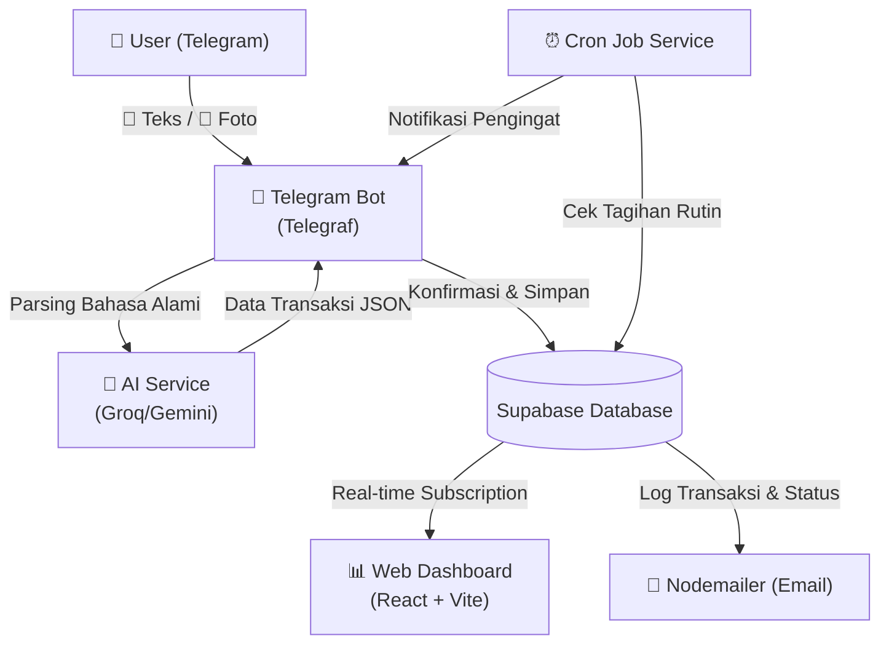

# 💎 Monify: Intelligent Family Financial Hub 🚀

Monify adalah **Intelligent Financial Management System** yang menggabungkan kecerdasan buatan (AI), otomasi, dan analitik real-time untuk mengelola keuangan keluarga secara terpadu dan efisien.

Sistem ini didesain khusus untuk sepasang suami istri (**Qisthi & Gita**) agar dapat memantau, mencatat, dan merencanakan arus kas keuangan keluarga mereka secara transparan.

---

## 🏗️ Arsitektur Sistem

Monify terdiri dari tiga komponen utama:
1. **Backend Server (Node.js + Express + Telegraf)**: Mengelola integrasi Bot Telegram, penjadwalan cron jobs untuk tagihan, integrasi AI, serta layanan email notifikasi.
2. **Frontend App (React + Vite + Tailwind CSS)**: Dashboard web premium dengan visualisasi interaktif untuk melihat arus kas, sisa anggaran kantong (*pockets*), aset, tagihan (*bills*), dan target celengan impian (*saving goals*).
3. **Database Layer (Supabase / PostgreSQL)**: Penyimpanan data terpusat dengan dukungan sinkronisasi real-time.

### Alur Aliran Data (Data Flow Diagram)



---

## ⚡ Fitur Utama & Kemampuan Sistem

### 1. 🤖 AI Telegram Bot (Moni)
- **Natural Language Parsing**: Mencatat pengeluaran, pemasukan, atau transfer hanya dengan mengetik kalimat santai (contoh: `"beli kopi starbucks 45rb"` atau `"gaji masuk 8.5jt"`).
- **Aktor Detection (Smart Group Support)**: Mengenali pengirim secara akurat berdasarkan user ID Telegram pengirim (`ctx.from.id`), memetakan langsung ke "Qisthi" (suami) atau "Gita" (istri), sehingga bot aman digunakan bersama dalam obrolan grup keluarga.
- **Multimodal OCR**: Membaca foto struk belanja, bukti bayar token listrik, tagihan, atau mutasi m-banking secara otomatis menggunakan model visi Gemini untuk mengambil nominal, kategori, dan detail lainnya secara real-time.
- **Smart Pocket & Asset Transfer**: Mendukung pemindahan dana antar aset secara alami (contoh: `"transfer ke gopay 100rb"`).

### 2. 📊 Web Dashboard Premium
- **Sidebar Modern & Dinamis**: Layout responsif yang dapat disembunyikan (*collapsible*) pada desktop untuk memaksimalkan area kerja, dan berubah menjadi drawer overlay pada perangkat mobile.
- **Ringkasan Arus Kas Cerdas**: Menampilkan grafik visual Income vs Expense bulanan serta persentase *Saving Rate* keluarga saat ini.
- **Widget Tagihan Mendatang (Upcoming Bills)**: Menyajikan tagihan aktif terdekat yang belum dibayar guna memudahkan alokasi dana bulanan.
- **Distribusi Aset & Kantong**: Pie chart interaktif untuk melihat sebaran kekayaan pada kantong (*pockets*) anggaran dan aset fisik (*assets*).

---

## 🔄 Alur Deduksi Saldo (Asset-Pocket Deduction Logic)

Monify menerapkan prinsip pencatatan ganda (*double-entry bookkeeping*) untuk menjaga keakuratan pelaporan total kekayaan (*Net Worth*):

1. **Kantong Anggaran (Pockets)**: Digunakan untuk alokasi dana bulanan atau kategori budget tertentu (misal: "Listrik dan Pulsa", "Operasional Bersama").
2. **Aset Sumber (Assets)**: Merupakan wadah fisik atau rekening penyimpanan uang (misal: Rekening BCA, Dompet LinkAja, Emas/Logam Mulia).

Setiap kali transaksi pengeluaran dikonfirmasi:
- Saldo berjalan pada **Pocket** yang dipilih akan berkurang sesuai nominal.
- Saldo pada **Asset** induk yang terhubung (*linked asset*) dengan pocket tersebut akan ikut berkurang secara otomatis.
- Jurnal transaksi disimpan ke database lengkap dengan `pocket_id`, `asset_id`, dan `actor` (eksekutor).

---

## 📁 Struktur Folder Proyek & Deskripsi Berkas

```text
assistant_keuangan/
├── backend/                           # SERVER UTAMA
│   ├── src/
│   │   ├── bot/                       # Core Bot Telegram
│   │   │   ├── init.ts                # Inisialisasi Middleware & Handlers
│   │   │   ├── middleware.ts          # Otentikasi & Deteksi Aktor (User ID)
│   │   │   ├── commands.ts            # Command bot (/saldo, /bayar, /help, dll)
│   │   │   ├── handlers.ts            # Registrasi Text & Photo Handlers
│   │   │   └── callbacks.ts           # Registrasi Callback Query Handlers
│   │   ├── config/
│   │   │   └── supabaseClient.ts      # Koneksi client Supabase
│   │   ├── constants/
│   │   │   └── keywords.ts            # Kata kunci pemetaan pesan teks
│   │   ├── helpers/
│   │   │   ├── buttons.ts             # Builder tombol inline keyboard konfirmasi
│   │   │   ├── formatters.ts          # Utilitas format mata uang IDR & teks
│   │   │   ├── iconMapper.ts          # Pemetaan ikon berdasarkan tipe pocket/asset
│   │   │   ├── naturalResponse.ts     # Pembangkit balasan teks AI alami
│   │   │   └── validators.ts          # Validasi struktur input teks
│   │   ├── handlers/                  # Handler Kejadian/Aksi
│   │   │   ├── callbacks/             # Pemroses klik tombol inline Telegram
│   │   │   │   ├── transactionCallback.ts   # Konfirmasi transaksi reguler
│   │   │   │   ├── billPaymentCallback.ts   # Konfirmasi pembayaran tagihan
│   │   │   │   ├── installmentCallback.ts   # Konfirmasi pembayaran cicilan
│   │   │   │   ├── assetTransferCallback.ts # Konfirmasi pemindahan aset
│   │   │   │   ├── savingGoalCallback.ts    # Konfirmasi tabungan impian
│   │   │   │   └── cancelCallback.ts        # Pembatalan transaksi pending
│   │   │   ├── photo/
│   │   │   │   └── receiptHandler.ts        # Pemroses pesan foto / OCR Struk (Aktif)
│   │   │   └── text/
│   │   │       ├── messageHandlers.ts       # Router teks alami non-command
│   │   │       ├── transactionHandlers.ts   # Pemroses pencatatan transaksi alami
│   │   │       ├── billHandlers.ts          # Pencarian & konfirmasi tagihan
│   │   │       ├── installmentHandlers.ts   # Pencarian & konfirmasi cicilan
│   │   │       ├── balanceHandlers.ts       # Pemeriksa saldo real-time
│   │   │       ├── reportHandlers.ts        # Pembuat rekap & ekspor CSV
│   │   │       ├── assetHandlers.ts         # Pemroses transfer asset alami
│   │   │       └── savingGoalHandlers.ts    # Pemeriksa target celengan impian
│   │   ├── services/                  # Logika Bisnis & Integrasi Layanan
│   │   │   ├── aiService.ts           # Integrasi model LLM Groq & Gemini
│   │   │   ├── cronService.ts         # Pengingat terjadwal tagihan bulanan
│   │   │   ├── lowFundService.ts      # Deteksi saldo minimum kantong
│   │   │   ├── notificationService.ts # Layanan kirim email Nodemailer
│   │   │   ├── pocketService.ts       # CRUD & Update Saldo Kantong
│   │   │   ├── assetService.ts        # CRUD & Update Saldo Aset
│   │   │   ├── transactionService.ts  # Pencatatan riwayat transaksi
│   │   │   ├── receiptAnalyzer.ts     # Analisis tipe dokumen secara kontekstual
│   │   │   └── parsers.ts             # Parser teks manual (Regex fallback)
│   │   ├── state/
│   │   │   └── pendingTransactions.ts # Penyimpan antrean transaksi sementara (10 menit)
│   │   └── index.ts                   # Entry point server Express & Bot
│   └── package.json
│
├── frontend/                          # CLIENT DASHBOARD WEB (React + Vite)
│   ├── src/
│   │   ├── layouts/
│   │   │   └── DashboardLayout.tsx    # Sidebar collapsible & Responsive Layout
│   │   ├── features/
│   │   │   ├── dashboard/             # Modul Ringkasan Finansial
│   │   │   │   ├── hooks/useDashboardData.ts
│   │   │   │   └── pages/OverviewPage.tsx
│   │   │   ├── assets/                # Modul Pemantau Aset Fisik
│   │   │   ├── pockets/               # Modul Manajemen Alokasi Budget
│   │   │   ├── transactions/          # Modul Jurnal & Riwayat Transaksi
│   │   │   └── bills/                 # Modul Manajemen Tagihan & Cicilan
│   │   └── App.tsx
│   └── package.json
└── README.md                          # Dokumentasi utama ini
```

---

## 🧹 Berkas Tidak Terpakai / Skeleton (Unused Files)

Berdasarkan hasil analisis struktur proyek, terdapat beberapa berkas yang teridentifikasi tidak aktif atau tidak terhubung ke alur sistem utama:

1. **`backend/src/handlers/photoHandlers.ts` (Legacy)**: Berkas ini merupakan pemroses pesan foto versi lama yang telah digantikan oleh pemroses baru yang lebih cerdas dan modular di `backend/src/handlers/photo/receiptHandler.ts`. Berkas lama ini tidak diimpor atau diregistrasikan di file routing mana pun.
2. **`app/` Folder (Skeleton Mobile App)**: Folder ini hanya berisi struktur dasar aplikasi mobile kosong (ikon drawable) tanpa adanya kode logika Android (Java/Kotlin) yang berjalan atau terhubung dengan backend utama saat ini.

---

## 🚀 Panduan Instalasi & Setup Cepat

### Kebutuhan Awal (Prerequisites)
- Node.js versi 18 ke atas
- Akun layanan Supabase (PostgreSQL Database)
- Token Bot Telegram dari `@BotFather`
- Akun Gmail & App Password (untuk pengiriman email Nodemailer)
- API Key Google Gemini & Groq Cloud

### 1. Inisialisasi Backend
1. Masuk ke folder backend:
   ```bash
   cd backend
   npm install
   ```
2. Salin template `.env.example` menjadi `.env` dan lengkapi konfigurasi kredensial database Supabase, Token Telegram, API Keys, serta Gmail SMTP.
3. Jalankan server dalam mode pengembangan:
   ```bash
   npm run dev
   ```

### 2. Inisialisasi Frontend
1. Masuk ke folder frontend:
   ```bash
   cd frontend
   npm install
   ```
2. Lengkapi berkas `.env.local` dengan URL Supabase dan Anonymous Key.
3. Jalankan server lokal:
   ```bash
   npm run dev
   ```

---

## 💡 Rekomendasi Optimasi & Pembaruan Sistem

Berikut adalah rekomendasi fitur dan perubahan fungsi agar sistem berjalan lebih optimal, terbagi berdasarkan fitur terkait:

### 1. 🤖 AI Telegram Bot (Moni)
- **Group Conversation State Management (Peningkatan State)**: Menggunakan database-backed session management untuk Telegraf. Hal ini penting untuk mengisolasi state transaksi pending ketika Qisthi dan Gita mengetik secara bersamaan di grup keluarga agar state data tidak tumpang tindih.
- **Interactive Inline Reports (Peningkatan Fitur Laporan)**: Menambahkan menu inline keyboard khusus pada pesan balasan `/help` atau command baru agar user dapat memicu pembuatan laporan mingguan/bulanan langsung dari Telegram dengan sekali klik tombol (bukan hanya command teks).

### 2. 📅 Bills Management (Sistem Tagihan & Paylater)
- **Auto-Recurring Auto-Debit (Otomasi Pembayaran)**: Menambahkan opsi otorisasi auto-debit dari aset terpilih untuk tagihan rutin (seperti tagihan listrik/wifi) ketika mendeteksi hari jatuh tempo lewat cron, dengan konfirmasi akhir dikirimkan ke Telegram.
- **Notifikasi Tagihan & Paylater Spesifik (Telah Diimplementasikan)**: Menyaring dan mendeteksi tipe tagihan paylater vs tagihan bulanan biasa via regex nama di tabel `bills` untuk memberikan emoji 💳/🧾 serta judul peringatan yang disesuaikan dalam pemberitahuan cron.

### 3. 💼 Assets Tracker (Pelacak Aset & Kekayaan)
- **Auto-caching Harga Emas (Peningkatan Nilai Aset)**: Mengintegrasikan cron job dengan API harga emas eksternal (seperti Metalprice API atau Logam Mulia scraper) untuk memperbarui harga emas per gram secara dinamis di database. Hal ini menjaga keakuratan widget Net Worth pada dashboard secara otomatis tanpa *hardcoded price*.

### 4. 🔐 Keamanan & Skalabilitas (Sistem Utama)
- **Multi-Family Separation (RLS Supabase)**: Mengatur Row Level Security (RLS) di database Supabase agar mendukung multi-keluarga. Struktur data dapat dipisahkan menggunakan kolom `family_id` sehingga satu instance database dapat digunakan oleh banyak keluarga dengan aman.
- **Strict CORS & API Gateway Protection**: Membatasi domain asal (CORS) backend ke URL frontend produksi secara ketat dan menggunakan API gateway untuk membatasi laju permintaan (rate limiting) dari pihak luar.
